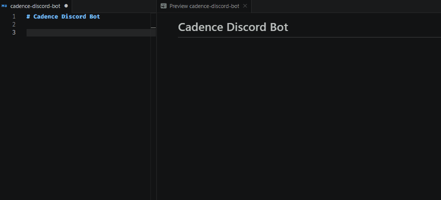

<div align="center">

<h1 align="center">Markdown Badges</h1>
<p align="center">
  Insert badges directly into any Markdown file
</p>

[](https://GitHub.com/GFrancV/vscode-markdown-badges/tags)


<a href="#description">Description</a>
•
<a href="#how-to-use">How to use</a>
•
<a href="#commands">Commands</a>
•
<a href="#settings">Settings</a>
•
<a href="#notes">Notes</a>
•
<a href="#requirements">Requirements</a>
•
<a href="#for-contributors">For contributors</a>
•
<a href="#license">License</a>
</div>

## Description

Insert badges from [markdown-badges.vercel.app](https://markdown-badges.vercel.app) directly into any Markdown file — 858+ badges across 50+ categories, always sourced live from the API.



## How to use

Open the Command Palette (`Ctrl+Shift+P` / `Cmd+Shift+P`) and search for **Markdown Badges**.

### Insert Badge(s)

The fastest way to find and insert badges.

1. Place your cursor where you want the badge in the file.
2. Run **`Markdown Badges: Insert Badge(s)`**.
3. Type to filter by name or category (`react`, `license`, `github actions`, …).
4. Select one or more badges with `Space`.
5. Press `Enter` — the Markdown is inserted at the cursor.

Selections are preserved as you refine the search, so you can filter multiple times and keep adding badges before inserting.

### Browse by Category

Useful when you want to explore what's available in a topic.

1. Place your cursor where you want the badge.
2. Run **`Markdown Badges: Browse by Category`**.
3. Pick a category from the list (sorted alphabetically).
4. Select one or more badges with `Space`.
5. Press `Enter` to insert.

### Output

Each accepted badge is inserted as a Markdown image link on its own line:

```markdown
[](https://reactjs.org/)
[](https://www.typescriptlang.org/)
```

---

## Commands

| Command | Description |
|---|---|
| `Markdown Badges: Insert Badge(s)` | Search all badges by name or category and insert |
| `Markdown Badges: Browse by Category` | Pick a category first, then browse and insert |
| `Markdown Badges: Clear Cache` | Force a fresh fetch from the API on next use |

---

## Settings

| Setting | Default | Description |
|---|---|---|
| `markdownBadges.apiUrl` | `https://markdown-badges.vercel.app/api` | Base URL of the Markdown Badges API |

You can point this to a self-hosted instance of the API if needed.

---

## Notes

- **Badges are loaded once per session** and cached in memory. The first invocation triggers a network request; subsequent ones are instant.
- **Filtering is local** — no extra API calls are made as you type.
- **Multi-file support** — the extension works in any open text file, not just `.md` files. The active cursor position is always used.

---

## Requirements

- VS Code 1.85 or higher.
- Internet access to reach the Markdown Badges API on first use per session.

---

## For contributors

### Setup

```bash
git clone https://github.com/gfrancv/vscode-markdown-badges.git
cd vscode-markdown-badges
npm install
```

### Build and debug

```bash
npm run compile   # single build → dist/extension.js
npm run watch     # rebuild on every file save
npm run lint      # TypeScript type-check (no emit)
```

Press `F5` to launch an **Extension Development Host** with the extension loaded. The default build task runs automatically before the host opens.

### Project structure

```
src/
├── extension.ts             # Entry point — registers all commands
├── api.ts                   # BadgeApiClient — fetch + in-memory cache
├── types.ts                 # Badge and ApiResponse interfaces
└── commands/
    ├── insertBadge.ts       # "Insert Badge(s)" command
    ├── browseByCategory.ts  # "Browse by Category" command
    └── shared.ts            # Shared QuickPick type and insert helper
```

### Scripts

| Script | What it does |
|---|---|
| `npm run compile` | Build extension (development, with source maps) |
| `npm run watch` | Rebuild on file changes |
| `npm run lint` | Type-check without emitting files |
| `npm run package` | Production bundle + `.vsix` package |

---

## License

This work is licensed under [The MIT License](LICENSE)
